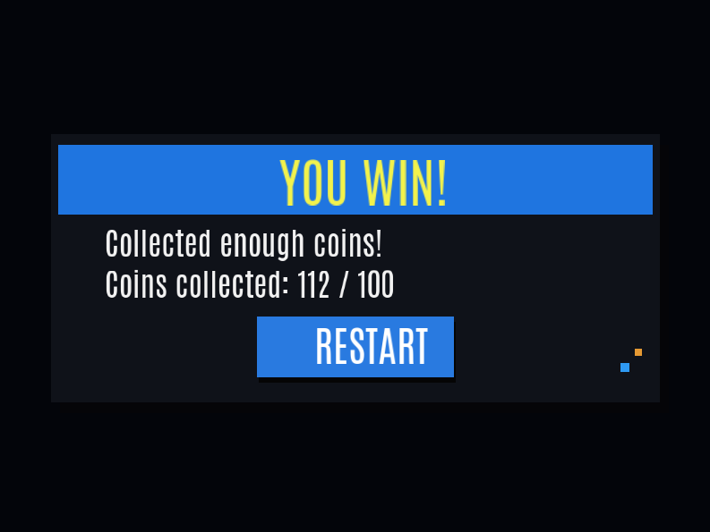

# HelpDuckky_OpenGL

# 🦆 HELP DUCKKY — 3D Maze Adventure Game  
A 3D grid-based adventure game built with **C++**, **OpenGL**, **GLM**, **Assimp**, and **FreeType**.  
Navigate through the maze, collect coins, find the gun, defeat enemies, and escape!

---

## 🎮 Gameplay Video (30-second Screen Recording)

[https://user-images.githubusercontent.com/your_upload_here/demo-video.mp4  ](https://youtu.be/M1kkcwXeQpk)
*(Replace this with your actual GitHub-hosted video or YouTube link)*

---

## 📸 Screenshots

### Main Menu

### Gameplay

### Win Screen

### Lose Screen

*(Place your screenshots inside a `/screenshots` folder in the repo — screenshots are allowed.)*

---

## 🕹️ Play on Itch.io  
You can directly play or download the game here:

➡ **[https://yourname.itch.io/help-duckky](https://tsukimoon7.itch.io/duckykeedinorsour)**  
*(Replace with your actual itch.io page URL)*

---

## 📦 Features

- 3D grid-based movement  
- Smooth camera interpolation  
- Collectible coins  
- Enemy detection & lose conditions  
- Gun pickup and shooting  
- Full UI system (menu, win/lose screen, retry button)  
- Skybox environment  
- Custom shaders  
- Text rendering (FreeType)
